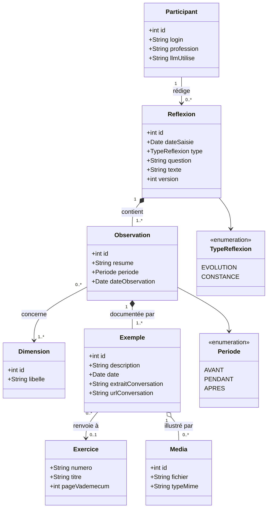

# Diagramme de classes — Ex11 « Tracking Shifts »

```mermaid
classDiagram
    class Participant {
        +int id
        +String login
        +String profession
        +String llmUtilise
    }

    class Reflexion {
        +int id
        +Date dateSaisie
        +TypeReflexion type
        +String question
        +String texte
        +int version
    }

    class Observation {
        +int id
        +String resume
        +Periode periode
        +Date dateObservation
    }

    class Dimension {
        +int id
        +String libelle
    }

    class Exemple {
        +int id
        +String description
        +Date date
        +String extraitConversation
        +String urlConversation
    }

    class Exercice {
        +String numero
        +String titre
        +int pageVademecum
    }

    class Media {
        +int id
        +String fichier
        +String typeMime
    }

    class TypeReflexion {
        <<enumeration>>
        EVOLUTION
        CONSTANCE
    }

    class Periode {
        <<enumeration>>
        AVANT
        PENDANT
        APRES
    }

    Participant "1" --> "0..*" Reflexion : rédige
    Reflexion "1" *-- "1..*" Observation : contient
    Observation "0..*" --> "1..*" Dimension : concerne
    Observation "1" *-- "1..*" Exemple : documentée par
    Exemple "0..*" --> "0..1" Exercice : renvoie à
    Exemple "1" o-- "0..*" Media : illustré par
    Reflexion --> TypeReflexion
    Observation --> Periode
```

## Dimensions prévues (valeurs initiales)

`technique`, `professionnelle`, `émotionnelle`, `éthique`, `sociale`, `autre`
